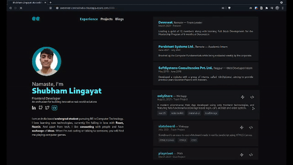

# Staring Animals Server

Feeling alone, don't you? No worries, our animals will look at you!

Visit: <a href="http://seeserver.centralindia.cloudapp.azure.com:8080/" target="_blank">The Staring Animals Server</a>

### Preview

### About

Made this simple Express server while learning express, how we can create a Virtual Machine on Azure and run our express server on it.

Things I learnt while developing this, are:
1. Using a Template Engine in Express: <a href="https://jade-lang.com/" target="_blank">Jade</a>
2. Send Static Files as response in Express
3. Creating a Virtual Machine on Microsoft Azure and configuring it for a Express (Node.js) server
4. Using a daemon process manager to keep my server online 24/7 - <a href="https://pm2.keymetrics.io/" target="_blank">PM2</a>
